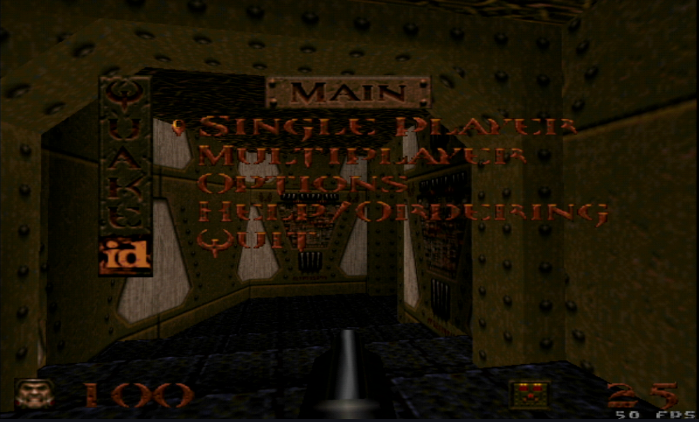
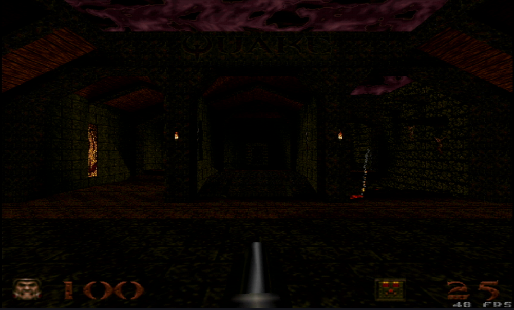

# QuakeSpasm-DC

A Sega Dreamcast port of [QuakeSpasm](https://github.com/sezero/quakespasm) with a
native PowerVR renderer.



## Features

- **Native PVR renderer** — geometry streams straight to the Tile Accelerator.
- **SH4 hardware math** (sh4zam).
- Hardware table fog, per-vertex lighting with dynamic lights, and lightstyle
  animation.
- Alias (`.mdl`) models, sky (flat / scrolling / skybox), warped water,
  particles, sprites, entity shadows, and underwater warp.
- Hardware mipmaps for square world textures; N64-style translucent overlay HUD.
- VMU save games (zlib-compressed), plus config stored on the VMU.

## Requirements

- [KallistiOS](https://github.com/KallistiOS/KallistiOS) (with the SH4 toolchain)
- SDL2, built for the Dreamcast
- [sh4zam](https://github.com/gyrovorbis/sh4zam) — SH4 SIMD math
- zlib (kos-ports)
- [mkdcdisc](https://gitlab.com/simulant/mkdcdisc) — builds the disc image

## Building

Source your KallistiOS environment first, then build the ELF:

```sh
source /opt/toolchains/dc/kos/environ.sh
cd Quake
./build_dreamcast.sh elf
```

The native PVR renderer is on by default (`USE_PVR_RENDER=1`); build with
`USE_PVR_RENDER=0` to fall back to the GLdc path.

## Making the CDI

Put your `pak0.pak` (and optional `pak1.pak` / OGG music) in `Dreamcast/cd/id1/`,
then run the full build to compile, link, and package the disc image:

```sh
cd Quake
./build_dreamcast.sh          # produces quakespasm.cdi
```

Boot the resulting `quakespasm.cdi` on real hardware (GDEMU / ODE) or an emulator
such as [Flycast](https://github.com/flyinghead/flycast) or Redream.



## License

GPLv2 — see [LICENSE.txt](LICENSE.txt). Quake game data is **not** included; you
must supply your own `pak0.pak`.
